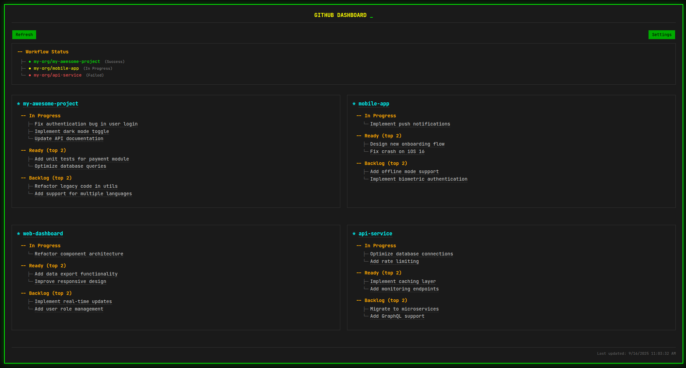

# gh-dashboard
Simple HTML dashboard to collate multiple Github Project boards and show workflow statuses.

This can be useful if you keep track of tasks across multiple Github Projects, and what an overview of all tasks in one place.

## Deployment
Deploy the index.html file to a place of your choosing (e.g. GitHub Pages, Netlify, Vercel, etc.)

## Usage
- Try the demo: https://martysweet.github.io/gh-dashboard/
- Uses GitHub Personal Access Token (PAT) for authentication
- Create a PAT at https://github.com/settings/tokens with `read:project`, `repo` scope
- Enter your token in the Settings panel of the dashboard
- Perfect for static deployments with no server-side authentication needed

### Why not OAuth?
- OAuth with Github requires server-side components, they do not currently support client-side only flows
- More info: 
- https://github.com/orgs/community/discussions/15752